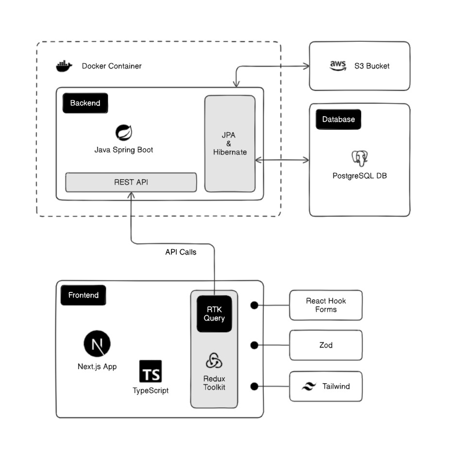

# Handy Man - Your Local Skill Network
HandyMan is a digital platform bridging homeowners with skilled handymen for on-demand repair and maintenance services. The system features **dual-role accounts** (users can switch between requesting or offering services), **bidding-based task assignments**, and **in-app messaging**. Built with `Next.js` (frontend), `Spring Boot` (backend), and `PostgreSQL`, it prioritizes local service matching, transparent pricing, and mutual review systems.

- [Frontend Repository](https://github.com/vishva-kalhara/handy-man-frontend)
   

## Core Features
- 📌 Task posting with emergency tagging
- 💰 Budget-based bidding system
- 🛠️ Skills verification & ratings
- 📍 Location-based service matching
- 💬 Integrated chat

Goal: Streamline home services while empowering local tradespeople.

# Backend Technologies
- `Java Springboot`
- `JPA`
- `Hibernate`
- `AWS S3, AWS Elastic BeanStalk`
- `Mapstruct`
- `PostgreSQL`
- `Repositry Pattern`

# Environment Variables

### Application Config
- `spring.application.name`
- `server.port`=`5000`
- `frontend_url`

### AWS S3 Bucket Config
- `aws.accessKey`
- `aws.secretKey`
- `aws.s3.bucketName`

### DB Config
- `spring.datasource.driver-class-name`=`org.postgresql.Driver`
- `spring.datasource.url`

### JPA Config
- `spring.jpa.hibernate.ddl-auto`=`update`
- `spring.jpa.show-sql`=`true`
- `spring.jpa.properties.hibernate.format_sql`=`true`
- `spring.jpa.properties.hibernate.dialect`=`org.hibernate.dialect.PostgreSQLDialect`

### JWT Config
- `jwt.secret`